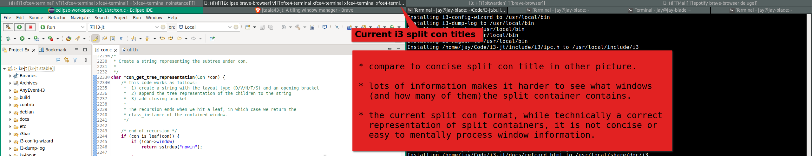

 i3-jt: my (opinionated) fork of i3wm
=====================================================

[](https://github.com/jtaala/i3/actions/workflows/main.yml)
[](https://github.com/jtaala/i3/issues)
[](https://github.com/jtaala/i3/pulls)

[](https://repology.org/metapackage/i3/versions)

This is a fork of i3wm with several implementations that are more easily done in a fork than with configuration changes.

It contains improvements (for me), including, reverse-layouts (i.e. new windows populate to the right or top of the current window), saner and much cleaner split container titles, and a small layout marker on window titles showing the parent container layout.

*Please note that these changes may (probably) only be appreciated by me and my sensitive window-tiling tendencies.  Feel free to fork and modify these changes to suit your tastes.*

## Added features

_Note: features are based off the lastest [i3 next branch](https://github.com/i3/i3/tree/next) so you can merge one of these feature branches into your fork if you are just interested in that feature._

### [Reverse layouts](https://github.com/i3/i3/compare/next...jtaala:right-to-left-layouts)

[Wilhelm Schuster](https://github.com/wlhlm) created a fantastic branch that implemented reverse layouts into i3.  I've contributed a small amount of code (mainly some small changes requested in the original [PR](https://github.com/i3/i3/pull/4246) and documentation) and have merged this work into my fork.

_I've also created a [new PR](https://github.com/i3/i3/pull/4794) which seeks to complete @whlm's great work and finally get it into i3._

<details>
  <summary><em>Click to expand reverse-layout documentation</em></summary>

### Reverse Layouts and fill order

>Reverse layouts refer to the order that new windows are added to the current container.  By default i3 *appends* new windows to a container.  That is, it adds new windows to the *right* or *bottom* of the currently selected window.
>
>Reversing a layout instead *prepends* new windows to the container.  That is, it adds new windows to the *left* or *top* of the currently selected window.
>
>This is is referred to as the *fill order* of the layout.
>
>To change the *fill order* of the current container layout use the +layout fill_order+ command.
>
>*Syntax*:
>```
>layout fill_order default|reverse|toggle
>```
>
>*Examples*:
>```
># toggle the current container fill order
>bindsym $mod+t layout fill_order toggle
>```

### Layout mode for new containers

>This option determines in which mode new containers on workspace level will start.
>
>Use reverse to have the workspace container prepend all new windows. That is, add new windows to the left (or top) of the currently selected window (the default behaviour appends windows).
>
>Syntax:
>```
>workspace_layout default|stacking|tabbed [reverse]
>```
>Examples:
>```
>workspace_layout stacking
># add new windows to the left
>workspace_layout tabbed reverse
>```

### Splitting containers

>The split command makes the current window a split container. Split containers can contain multiple windows. For horizontal layouts, new windows can be placed to the right (splith) or left (splith reverse) or the current window. For vertical layouts, new windows can be placed to the bottom (splitv) or top (splitv reverse) of the current window.
>
>If you apply this command to a split container with the same orientation, nothing will happen. If you use a different orientation, the split container’s orientation will be changed (if it does not have more than one window). The toggle option will toggle the orientation of the split container if it contains a single window. Otherwise it makes the current window a split container with opposite orientation compared to the parent container. Use layout toggle split to change the layout of any split container from splitv to splith or vice-versa. You can also define a custom sequence of layouts to cycle through with layout toggle, see [manipulating_layout].
>
>Syntax:
>```
>split vertical|horizontal|toggle
>```
>An alternate syntax is also provided which may be preferred for [reverse_layouts]:
>```
>split left|right|up|down
>```
>where split left creates a horizontal split layout, and split up creates a vertical split layout each with a reverse fill order (i.e. new windows are placed to the left or top of the current window, respectively).
>
>split right and split down are aliases for split horizontal and split vertical respectively, and are provided for consistency.
>
>Example:
>```
>bindsym $mod+v split vertical
>bindsym $mod+h split horizontal
>bindsym $mod+v split up
>bindsym $mod+h split left
>bindsym $mod+t split toggle
>```

### Manipulating layout

>Use layout toggle split, layout stacking, layout tabbed, layout splitv or layout splith to change the current container layout to splith/splitv, stacking, tabbed layout, splitv or splith, respectively.
>
>Add reverse to layout default, layout tabbed, layout stacking, layout splitv or layout splith to have the layout prepend all new windows. That is, add new windows to the left (or top) of the currently selected window (the default behaviour appends windows).
>
>Specify up to four layouts after layout toggle to cycle through them. Every time the command is executed, the layout specified after the currently active one will be applied. If the currently active layout is not in the list, the first layout in the list will be activated.
>
>To make the current window (!) fullscreen, use fullscreen enable (or fullscreen enable global for the global mode), to leave either fullscreen mode use fullscreen disable, and to toggle between these two states use fullscreen toggle (or fullscreen toggle global).
>
>Likewise, to make the current window floating (or tiling again) use floating enable respectively floating disable (or floating toggle):
>
>Syntax:
>```
>layout default|tabbed|stacking|splitv|splith [reverse]
>layout toggle [split|all]
>layout toggle [split|tabbed|stacking|splitv|splith] [split|tabbed|stacking|splitv|splith]…
>```
>Examples:
>```
>bindsym $mod+s layout stacking
>bindsym $mod+l layout toggle split
>bindsym $mod+w layout tabbed reverse
>
># Toggle between stacking/tabbed/split:
>bindsym $mod+x layout toggle
>
># Toggle between stacking/tabbed/splith/splitv:
>bindsym $mod+x layout toggle all
>
># Toggle between stacking/tabbed/splith:
>bindsym $mod+x layout toggle stacking tabbed splith
>
># Toggle between splitv/tabbed
>bindsym $mod+x layout toggle splitv tabbed
>
>># Toggle between last split layout/tabbed/stacking
>bindsym $mod+x layout toggle split tabbed stacking
>
># Toggle fullscreen
>bindsym $mod+f fullscreen toggle
>
># Toggle floating/tiling
>bindsym $mod+t floating toggle
>```
</details>

### [Concise split container titles](https://github.com/i3/i3/compare/next...jtaala:concise-con_get_tree_representation-rewrite)

Current split container titles, while technically a correct representation of child windows, are not concise or easy for users to mentally process child window information.

This feature aims to simplify and make split container titles more concise and easy to read.

_Please note I'm referring to split container title formatting (containers with multiple child windows) and not window title formatting._

You can see the difference compared to the current i3 split container title formatting in the two images below (the first is with initial implementation of this feature branch):




_Note these pictures are of an earlier implementation.  The current implementation may differ._

### [Parent layout marker in window titles](https://github.com/i3/i3/compare/next...jtaala:parent-layout-marker-in-window-title)

_Note this was designed as an alternative / enhancement for i3's window indicator (coloured line that indicates current parent layout)._

I prefer having a small marker/symbol (which show it's parent layout) prepended to window titles.

One use case where this may be preferable to i3's window indicator is that there is no indicator for tabbed or stacked layouts.  Otherwise, it's a more a user preference things (I just find it easier as I instinctively look at window titles anyway).

| Parent layout | Marker | Reverse-layout marker |
| --- | --- | --- |
| default | ◪ | ◩ |
| vertical | ⬓ | ⬒ |
| horizontal | ◨ | ◧ |
| tabbed | 🡆 | 🡄 |
| stacked | 🡇 | 🡅 |
| floating | ⮻ | ⮻ |

_Note the reverse-layout markers needs the [right-to-left-layouts](https://github.com/i3/i3/compare/next...jtaala:right-to-left-layout-parent-layout-marker) branch._

## About i3
i3 is a tiling window manager for X11.

For more information about i3, please see [the project's website](https://i3wm.org/) and [online documentation](https://i3wm.org/docs/).

For information about contributing to i3, please see [CONTRIBUTING.md](https://github.com/i3/i3/blob/next/.github/CONTRIBUTING.md).
