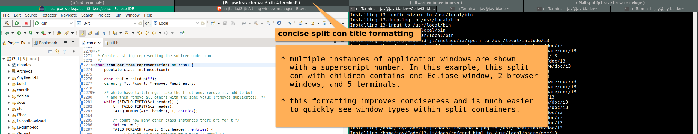

 i3-jt: my (opinionated) fork of i3wm
=====================================================

This is a fork of i3wm with several implementations that are more easily done in a fork than with configuration changes.

It contains improvements (for me), including saner and cleaner split container titles and a small layout marker on window titles showing the parent container layout.

*Please note that these changes may (probably) only be appreciated by me and my sensitive window-tiling tendencies.*

## Added features

_Note: features are based off the lastest [i3 stable branch](https://github.com/i3/i3/tree/stable) so you can merge one of these feature branches into your fork if you are just interested in that feature._

### [Concise split container titles](https://github.com/i3/i3/compare/stable...jtaala:concise-con_get_tree_representation-rewrite)

Current split container titles, while technically a correct representation of child windows, are not concise or easy for users to mentally process child window information.

This feature aims to simplify and make split container titles more concise and easy to read.

_Please note I'm referring to split container title formatting (containers with multiple child windows) and not window title formatting._

You can see the difference compared to the current i3 split container title formatting in the two images below (the first is with initial implementation of this feature branch):

### [Parent layout marker in window titles](https://github.com/i3/i3/compare/stable...jtaala:parent-layout-marker-in-window-title)

_Note this was designed as an alternative / enhancement for i3's window indicator (coloured line that indicates current parent layout)._

I prefer having a small marker/symbol (which show it's parent layout) prepended to window titles.

One use case where this may be preferable to i3's window indicator is that there is no indicator for tabbed or stacked layouts.  Otherwise, it's a more a user preference things (I just find it easier as I instinctively look at window titles anyway).

| parent layout | prepended window title symbol |
| --- | --- |
| vertical | ⬒ |
| horizontal | ◧ |
| tabbed | ▣ |
| stacked | ▤ |
| floating | ⮻ |

## About i3
i3 is a tiling window manager for X11.

For more information about i3, please see [the project's website](https://i3wm.org/) and [online documentation](https://i3wm.org/docs/).

For information about contributing to i3, please see [CONTRIBUTING.md](https://github.com/i3/i3/blob/next/.github/CONTRIBUTING.md).
